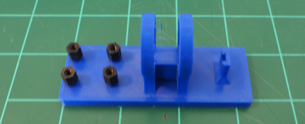
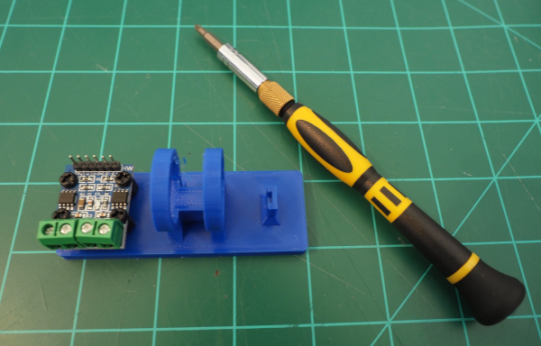
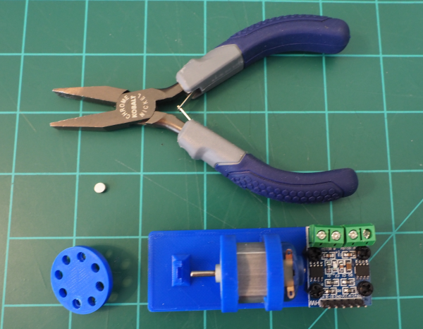
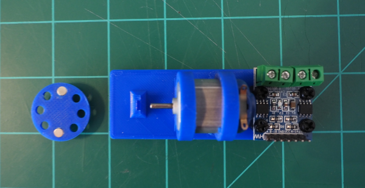
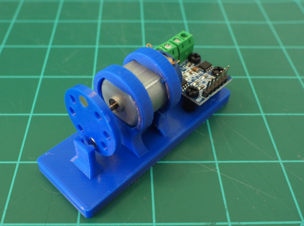
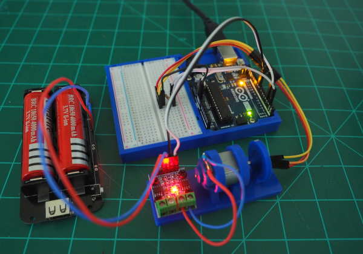

# Motor Mount Assembly

## Step 1: Print the Parts

The STL files for the motor mount and the flywheel are in the stl folder of this project. The parts you see below were printed with PLA using Ultimaker Cura 4 to set up the prints.

* Profile: Super Quality (default settings)

## Step 2: Attach the Motor Controller Standoffs

Screw the motor controller standoffs into the motor mount. You may want to use cyanoacrylate glue to hold the standoffs in place if the standoffs seem loose in the mounting holes and you are not planning on re-using the standoffs for other projects.

## Step 3: Attach the Motor Controller

Attach the DC Motor controller to the standoffs using M3 Nylon screws.

## Step 4: Insert the Motor

Insert the motor into the motor mount from the controller side of the mount:

## Step 5: Attach the Magnets

In the picture above you see that we are preparing to insert the neodymium magnets to the flywheel. We are going to use flat pliers to press the magnets into the 2 positions opposite one another on the flywheel.

These can be identified by the flange that the other holes in the flywheel do not have.

## Step 6: Attach the Flywheel

Press the flywheel on the motor shaft. You may need to back the motor out of the mount to provide adequate clearance between the sensor mount and the flywheel. Once the flywheel is securly on the shaft return the motor to a position  <1mm from the sensor mount.

Do __NOT__ use adhesives on the flywheel at this point. It may need to be adjusted once assembly is complete.

## Step 7: Attach the Hall Effect Sensor
You have options on how the hall effect sensor is wired. To keep things simple in the picture below I illustrate using the breadboard to include the pull up resistor. Pin 2 is used for the input signal just as it is in the [avrs-hall-sensor](https://github.com/bytetrail/avrs-hall-sensor) project.

## Step 8: Motor Controller Wiring
In the image above you can see that the motor controller is wired to the battery and to the Arduino. The example above is using a 5V power supply to the motor controller using the [Lithium Battery Shield Micro USB](https://www.amazon.com/gp/product/B07SZKNST4). 

__Wiring__

Controller PIN | Arduino Pin
---------------|------------
 B-1B | Pin 4
 B-1A | Pin 11

