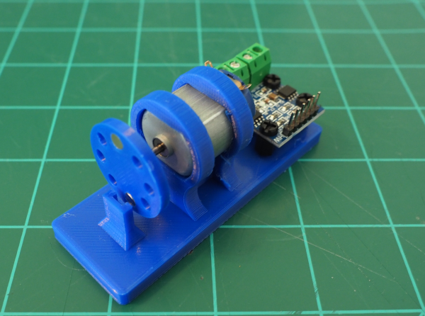

# avrs-rpm-sensor

This project is a simple sensor example using embedded Rust, Arduino Uno R3, and a hall-effect sensor. This project uses the same environment we setup in the [avrs-hall-sensor](https://github.com/bytetrail/avrs-hall-sensor) project.

# Getting Started

The parts list below is for the project as described here. You may substitute a different motor; however, you would then need to build your own motor and sensor mount.

## Parts List
* Arduino Uno R3
* [A3144 Hall Effect Sensor](https://www.amazon.com/gp/product/B07QNX6HWT)
* 10k&#x3a9; Resistor
* Jumper wires
* [4mm x 1mm neodymium magnet](https://www.amazon.com/gp/product/B076Q8SMBJ) - 2ea
* [0-6V 5000RPM Mini Motor](https://amazon.com/https://www.amazon.com/gp/product/B07YBVQZNJ)
* [M3 6mm Nylon Standoff](https://www.amazon.com/gp/product/B014K8MXO8/)

## Assembly

We printed a motor mount that holds the motor, a flywheel with magnets, and a Hall-Effect sensor for this project. The [construction guide](CONSTRUCTION.md) explains the basic assembly process.